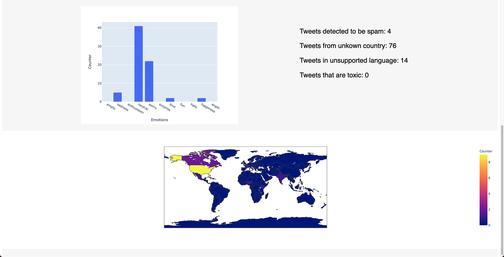

<p align="center">
  
</p>
<p align="center">
  <b>Web based python application to obtain location and sentiments of tweets </b>
</p>



## Installation
Fastest way to deploy this web application is by directly cloning [Friday Repository](https://github.com/albertbaiges/friday).
But this is not currently available since the repository is in private mode due to the fact that the app contains some private Twitter API Keys.

So right now this code can only be deployed by sending this source code. In the future it will become public once it is prepared to work with user defined API Keys in a text file. But this is not done yet in order achieve a ready to use deployment and to ease the process of making demos.

Once the source files are downloaded, all dependencies of the webapp will be listed in the requirements.txt file and can be easily installed in the Python enviromentby by running 

``` lang-zsh
  pip install -r requirements.txt
```

## Usage
To start the webapp it is only needed to execute the webapp.py file via

``` lang-zsh
  python webapp.py
```

Then, the application will be running in the port of the host machine specified in the command line. You can direcly click on the URL shown on command line to open the application on your default browser.

Once you access to the webapp through your browser you will appreciate two boxes (TextAreas) where the webapp expects you to behave as follows.
The user is expected to introduce the keyword or the hashtag (#name) which wants to analyse in the left hand box. Whereas in the right hand box it is need to  specify the number of tweets to be analysed. Then just click on Submit and wait until the results are shown once the page ends up loading.
The processing time until everythin is display will depend on the data introduced previously.

## Important

Please recall that the Twitter API Key has some rate limits for windows of 15 minutes, so if you try to make many tweet requests (large number of samples or repeating a lot of requests in the 15 minute window) the Twitter API will start responding with a 429 Too Many Requests Error and you will have to wait for the new window in order to keep using the application.

## Developers
* [Albert Baiges](https://github.com/albertbaiges)  
* [Sandra Rodriguez](https://github.com/SandraRoDiaz)
